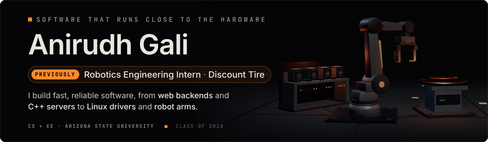

    

 

<picture><source media="(prefers-color-scheme: dark)" srcset="assets/lane-backend-dark.svg"></picture> 
  

<picture><source media="(prefers-color-scheme: dark)" srcset="assets/lane-systems-dark.svg"></picture> 
  

<picture><source media="(prefers-color-scheme: dark)" srcset="assets/lane-robotics-dark.svg"></picture> 
  

Every button links to the code behind it.
